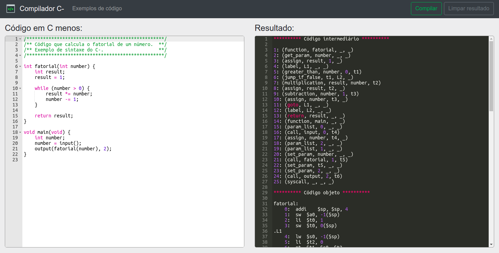

# Compilador C menos


### Compilador online: https://diegowendel.github.io/compilador-cmenos

Compilador desenvolvido para compilar a linguagem de programação C-. Tal linguagem, nada mais é que um subconjunto da linguagem C, onde as principais diferenças se dão no fato de permitir somente valores inteiros, não possuir ponteiros e não utilizar bibliotecas (especificações são listadas abaixo). A implementação deste compilador é baseada na teoria presente no livro [Compiler Construction: Principles and Practice - Kenneth C. Louden](https://www.goodreads.com/book/show/1760385.Compiler_Construction).

O resultado final do compilador em execução pode ser visualizado e testado no site. Nele é possível digitar código e compilar em tempo real, ~~além de selecionar as fases de compilação desejadas~~ (seleção de fases será adicionada em breve ao site).

<p align="center">
  
</p>

A aplicação retorna código intermediário, código objeto e código de máquina. Onde todos estes compilados foram desenvolvidos para a execução em um sistema operacional que roda sobre uma [máquina alvo desenvolvida em verilog](https://github.com/diegowendel/processador-mips). Portanto, é possível escrever código, compilar e testar na máquina alvo compatível que executa sobre plataformas FPGA.

---

## Como rodar

### Pré-requisitos

Para conseguir executar o compilador em sua máquina é necessário instalar antes os pacotes **bison (*General-Purpose Parser Generator*)** e **flex (*The Fast Lexical Analyzer*)**. Portanto, execute os comandos abaixo se não tiver os pacotes previamente instalados.

```
sudo apt-get update
sudo apt-get upgrade
sudo apt-get install flex bison
```

### Compilando código

- Guarde seus programas a serem compilados na pasta `src/main/programs`.
- Mude para o diretório `src/main/compiler`.
- Execute o script `compila.sh` para compilar algum código (Exemplo abaixo).

```
./compila.sh ../programs/fatorial.c
```

- O resultado é exibido no terminal e os arquivos de resultado são gerados na pasta `src/main/programs`.

## Especificação

### Grámatica BNF da linguagem

1. program → declaration-list
2. declaration-list → declaration-list declaration | declaration
3. declaration → var-declaration | fun-declaration
4. var-declaration → type-specifier ID ; | type-specifier ID [ NUM ] ;
5. type-specifier → int | void
6. fun-declaration → type-specifier ID ( params ) compound-stmt
7. params → param-list | void
8. param-list → param-list , param | param
9. param → type-specifier ID | type-specifier ID [ ]
10. compound-stmt → { local-declarations statement-list }
11. local-declarations → local-declarations var-declarations | empty
12. statement-list → statement-list statement | empty
13. statement → expression-stmt | compound-stmt | selection-stmt | iteration-stmt | return-stmt
14. expression-stmt → expression ; | ;
15. selection-stmt → if ( expression ) statement | if ( expression ) statement else statement
16. iteration-stmt → while ( expression ) statement
17. return-stmt → return ; | return expression ;
18. expression → var = expression | simple-expression
19. var → ID | ID [ expression ]
20. simple-expression → additive-expression relop additive-expression | additive-expression
21. relop → <= | < | > | >= | == | !=
22. additive-expression → additive-expression addop term | term
23. addop → + | -
24. term → term mulop factor | factor
25. mulop → * | /
26. factor → ( expression ) | var | call | NUM
27. call → ID ( args )
28. args → arg-list | empty
29. arg-list → arg-list , expression | expression

Palavras reservadas: **else** **if** **int** **return** **void** **while**

Símbolos: + - * / < <= > >= == != = ; , ( ) [ ] { } /* */

ID = letra letra*

NUM = digito digito*

letra = a | .. | z | A | .. | Z

digito = 0 | .. | 9

Comentários: /* ... */ ou //
